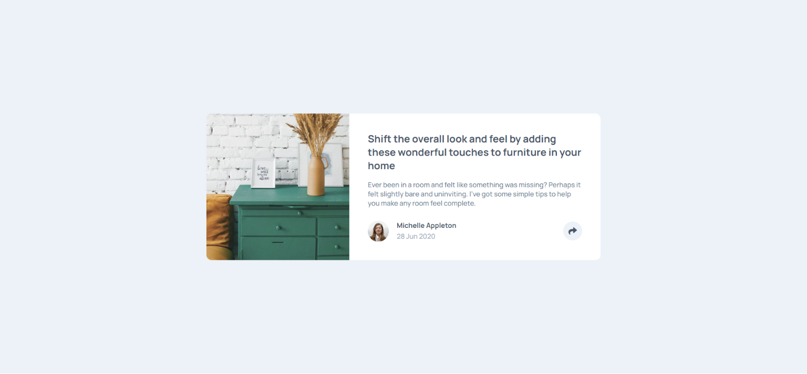
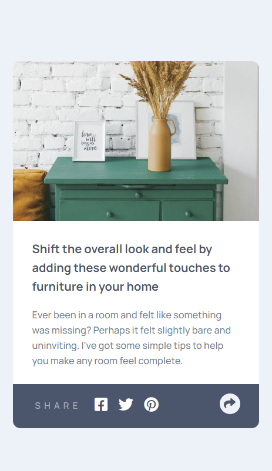

## Table of contents

- [Overview](#overview)
  - [The challenge](#the-challenge)
  - [Screenshot](#screenshot)
  - [Links](#links)
- [My process](#my-process)
  - [Built with](#built-with)
  - [Useful resources](#useful-resources)
- [Author](#author)

## Overview

### The challenge

Users should be able to:

- View the optimal layout for the component depending on their device's screen size
- See the social media share links when they click the share icon

### Screenshot

### Links

- Solution URL: [Add solution URL here](https://your-solution-url.com)
- Live Site URL: [Add live site URL here](https://your-live-site-url.com)

## My process

### Built with

- Semantic HTML5 markup
- CSS custom properties
- Flexbox
- Sass
- [JavaScript](https://developer.mozilla.org/en-US/docs/Web/JavaScript)

## Author

- Frontend Mentor - [@alessiopisanoweb](https://www.frontendmentor.io/profile/alessiopisanoweb)
- Twitter - [@ap\_\_dev](https://twitter.com/ap__dev)
